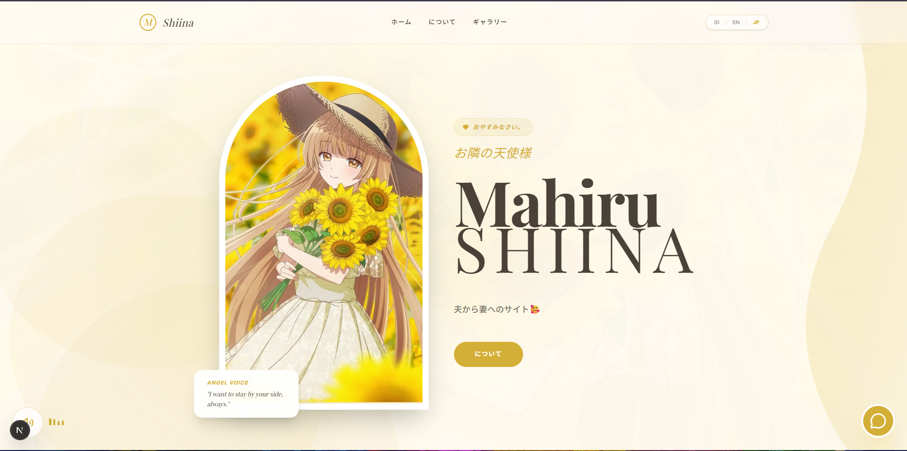

# 👼 Mahiru Shiina Bini Guweh tuh🤭 - "The Angel Next Door Spoils Me Rotten"



> A beautiful fansite dedicated to Mahiru Shiina from the anime "Otonari no Tenshi-sama".  
> *"My Bini Guweh, not karbit! 🙄"*

## ✨ Features

- 🎨 **Beautiful UI** - Elegant gold-themed design with smooth animations
- 💬 **AI Chat** - Chat with Mahiru AI powered by Groq API
- 🌐 **Multi Language** - Support for Indonesian, English, and Japanese
- 🖼️ **Interactive Gallery** - Lightbox modal with detailed photo viewer
- 📱 **Fully Responsive** - Works perfectly on all devices
- 🎵 **Background Music** - Relaxing BGM while browsing
- 💕 **"My Bini Guweh"** - Pre-emptive strike for karbit accusations! 😆

## 🚀 Live Demo

[Coming Soon] - Deployed on Vercel

## 🛠️ Tech Stack

- **Framework:** Next.js 15
- **Language:** TypeScript
- **Styling:** Tailwind CSS
- **Animations:** Framer Motion
- **Icons:** Lucide React
- **AI API:** Groq (Llama 3 70B)
- **Deployment:** Vercel

## 📦 Installation
```bash
 1. Clone the repository

git clone https://github.com/nafis/mahiru-fansite.git
cd mahiru-fansite
2. Install dependencies
bash
npm install
# or
yarn install
3. Set up environment variables
Create a .env.local file in the root directory:

env
GROQ_API_KEY=your_groq_api_key_here
Get your Groq API key from console.groq.com

4. Run the development server
bash
npm run dev
# or
yarn dev
Open http://localhost:3000 to see the result.
```
📁 Project Structure
text
mahiru-fansite/
├── app/
│   ├── api/
│   │   └── chat/
│   │       └── route.ts    # Groq API integration
│   ├── components/
│   │   ├── ChatWithMahiru.tsx
│   │   ├── About.tsx
│   │   ├── Gallery.tsx
│   │   ├── Hero.tsx
│   │   ├── Footer.tsx
│   │   └── AudioPlayer.tsx
│   ├── context/
│   │   └── LanguageContext.tsx
│   └── page.tsx
├── public/
│   ├── img/                 # Mahiru images (1.jpg - 6.jpg)
│   ├── audio/
│   │   └── bgm.mp3         # Background music
│   └── preview.png         # Preview image for README
├── lib/
│   └── mahiru-data.ts      # Images and audio exports
└── ...

🎮 How to Use
Chat with Mahiru
Click the gold chat button in the bottom right corner

Type your message in Indonesian, English, or Japanese

Mahiru will respond as her character (gentle, caring, a bit tsundere!)

Gallery
Browse through Mahiru's photos

Click "View Moment" or tap any image

Use arrow keys or on-screen buttons to navigate

Press ESC or click outside to close

Language
Toggle between Indonesian, English, and Japanese using the language switcher

🔧 Environment Variables
Variable	Description	Required
```bash
GROQ_API_KEY	Your Groq API key for AI chat	Yes
```
🚢 Deployment
Deploy to Vercel
Push your code to GitHub

Import your repository to Vercel

Add environment variable GROQ_API_KEY in Vercel dashboard

Deploy!

```bash
# Or using Vercel CLI
vercel --env GROQ_API_KEY=your_key_here
```
📝 Credits
Character: Mahiru Shiina from "The Angel Next Door Spoils Me Rotten" (Otonari no Tenshi-sama)

Anime Studio: Project No.9

Author: Saekisan

Fansite Creator: Nafis

💕 Special Note
This fansite is made with love for Mahiru Shiina,
My Bini Guweh — and definitely NOT KARBIT! 🔥

If anyone calls this karbit, I'm ready to debate! 😤

📄 License
This project is for personal/fan use only. All rights belong to their respective owners.

<div align="center"> Made with <span style="color: red;">❤️</span> by Nafis <br /> <sub>My Bini Guweh, not karbit! 🙄</sub> </div>
